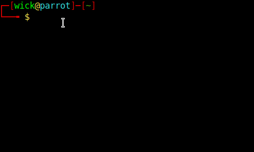

DEMO

# figwi

figwi is a tool that can be used to create fancy text from plain text, it is similar to figlet .. i have written code for only lowecase letters and excluded uppercase letters and numbers from it, It is just to show how figlet can be implemented using c++ . it can be written for uppercase letters by minor editing. This code will run in linux systems for running it in windows systems you will have to redefine gotoxy() function , it is simple to do..

for using figwi you just have to download the code or just copy and paste it on any file

use g++ to compile the file

g++ -o outputfile inputfile.cpp

to run it use

root@linux$./outputfile  a b c d e f any alphabets

every alphabet should be seperated by using a space .

root@linux$./outputfile abcd 
will not work only a will be formatted

root@linux$./outputfile a b c d 
will work 
fancy formatted text will be generated

This code is only for understanding purposes , i tried to make a program to simulate a result of famous figlet tool to format the text, hence this figwi was created!!!
Thanks!!!

